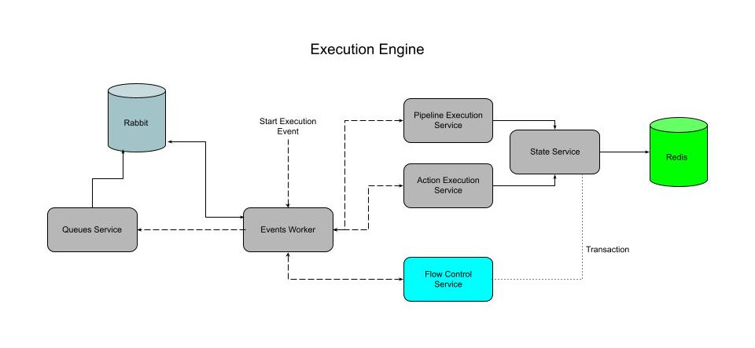

# PoC Events Worker

## Concept

This repository is to show how particular pieces of execution engine are interacting with each other. 
The concept is not fully mature and will need to be adjusted when we know answers for problematic questions.

## Architecture

## Scripts

Inside `execution-engine` directory there are following `npm` scripts:

`npm run dev` - run the PoC in development mode

`npm run dev:watch` - run the PoC in development mode with auto-reload

`npm test` - run `jest` unit tests
